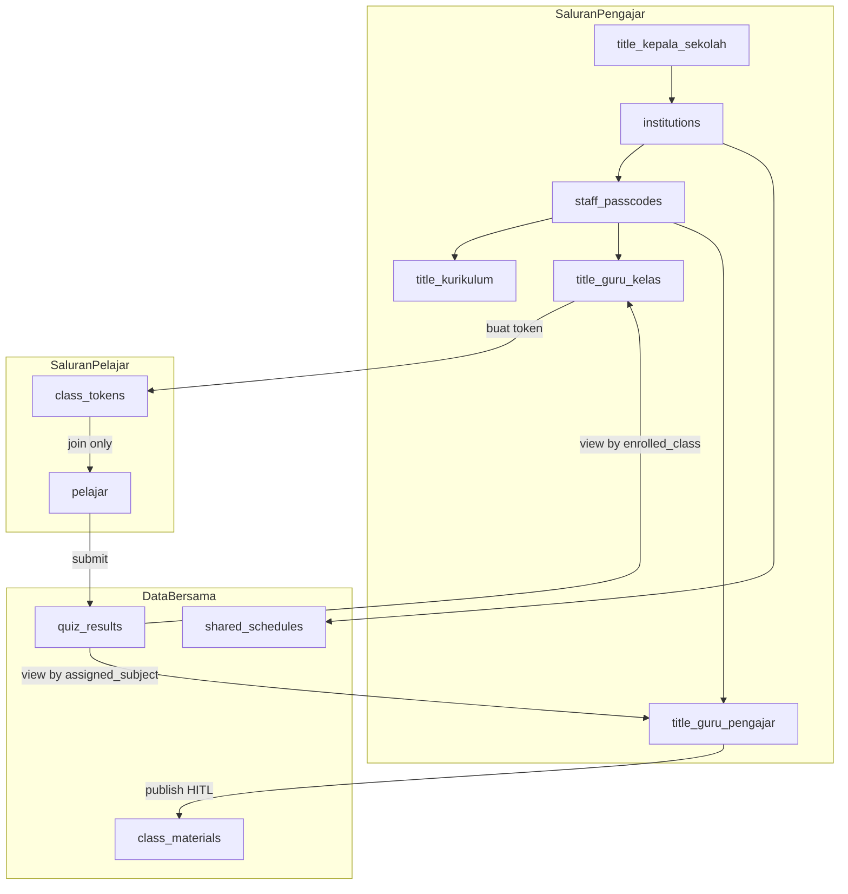
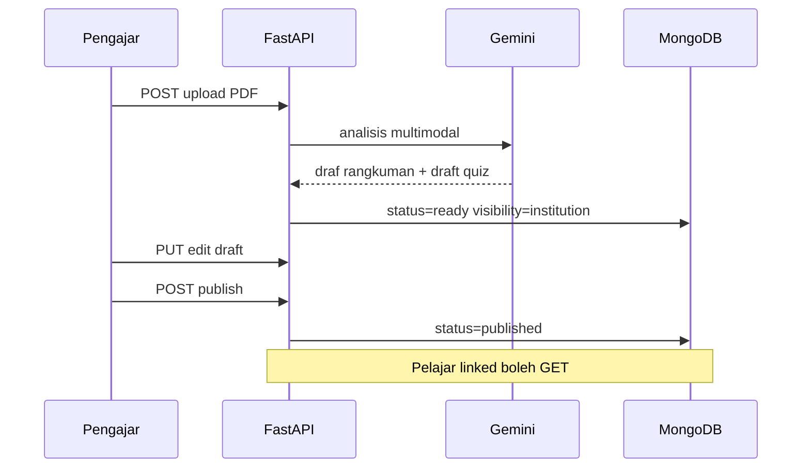
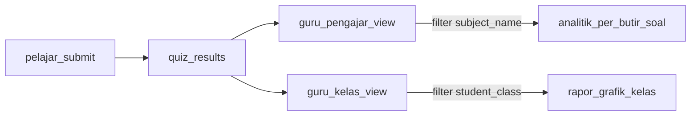

# Rencana Backend: Portal Guru (SRS v1.0 + Addendum v1.1)

**Dokumen acuan:**

- [doc-detail-projek/srs-portal-guru.md](doc-detail-projek/srs-portal-guru.md) — SRS v1.0 (ekosistem, HITL, shared_schedules)
- [doc-detail-projek/srs-role-guru.md](doc-detail-projek/srs-role-guru.md) — **Addendum v1.1** (hierarki sub-role, Class Token, Passcode Jabatan, isolasi query)

Audit kode: [backend/server.py](backend/server.py) (~3668 baris, MongoDB `eduscanner_ai`).

## Kondisi saat ini

Backend EduAI sudah kuat untuk **pelajar mandiri**: auth Supabase, profil (`education_level`, `institution` teks, `current_semester`), jadwal/maple di `users.subjects` + `users.schedule`, auto-folder di `save_education_settings`, pipeline dokumen/kuis/recap/TTS, chat persisten per dokumen.

**Belum ada** lapisan B2B2C portal guru:

| SRS | Status backend |
|-----|----------------|
| `role`: `pengajar` / `pelajar` | Tidak ada di model `User` |
| Koleksi `institutions` + `institution_code` unik | Tidak ada |
| Koleksi `shared_schedules` | Tidak ada |
| `GET /schedule/sync` | Tidak ada |
| HITL publish (`published`) ke kelas | Dokumen/kuis hanya `user_id` pribadi, `ready` langsung |
| Dashboard analitik kelas untuk pengajar | Hanya `GET /progress` milik sendiri |
| Autopilot pelajar terikat kode | Tidak ada |
| Sub-role `title` (kepala/kurikulum/guru_kelas/guru_pengajar) | Tidak ada |
| `class_tokens` (pelajar ≠ `institution_code`) | Tidak ada |
| Passcode jabatan pengajar instan | Tidak ada |
| Analytics dual-view (`assigned_class` / `assigned_subject`) | Tidak ada |

### Perubahan arsitektur dari Addendum v1.1 (wajib)

| Konsep v1.0 | Pembaruan v1.1 |
|-------------|----------------|
| Satu `institution_code` untuk guru + siswa | **Dua saluran:** `institution_code` = induk **pengajar**; `class_token` = **pelajar** saja |
| Join pelajar via `institution_code` | **Dilarang** — cegah privilege escalation ke portal guru |
| Satu peran pengajar homogen | **`title`** bertingkat + scope query |
| Persetujuan manual antar guru | **Passcode jabatan instan** (aktivasi seketika) |
| Satu dashboard analitik | **Single Data Source, Multiple Views** pada `quiz_results` |



---

## Prinsip desain backend

1. **Dua saluran registrasi terpisah** — pengajar: `institution_code` + `staff_passcode`; pelajar: **`class_token` only** (SRS v1.1 §1.1 poin 2).
2. **Scope by `title`** — setiap endpoint `/teacher/*` memfilter query lewat `deps/scope.py` (`assigned_class`, `assigned_subject`, atau institusi penuh untuk `kepala_sekolah`/`kurikulum`).
3. **Referensi, bukan salin massal** — materi institusi satu PDF, banyak pelajar baca via ACL + `enrolled_class`.
4. **HITL di server** — `published` wajib sebelum pelajar `GET`; `guru_pengajar` hanya publish untuk `assigned_subject`.
5. **Backward compatible** — tanpa `institution_code` dan tanpa `class_token` → mandiri (`PUT /user/education` tetap).
6. **AI akademik saja** — system prompt menolak tema BK/konseling/inventaris Lab-Perpus (SRS v1.1 §5.2); validasi di `_audience()` / teacher studio service.
7. **Reuse** — `_audience()`, analisis PDF, `_public_quiz()`, audit log, WebSocket.

### Validasi desain (review ADSPL — disetujui)

- **Referensi bukan salin massal** — satu PDF institusi, banyak pelajar query via `visibility` + `institution_code`.
- **HTTP 403** pada `PUT /user/education` saat `enrolled_class` / `class_token_used` terisi (pelajar autopilot) — hardening di server.
- **Quiz ACL** — `_public_quiz()` untuk attempt; analitik guru terpisah di Fase 4.

---

## Fase 0 — Fondasi skema, auth role, & refactor router (WAJIB)

**Tidak lagi opsional:** semua fitur portal guru masuk modul terpisah sejak awal. [server.py](backend/server.py) (~3600 baris) hanya menyisakan app factory, middleware, mount router, dan shared `db`/helpers.

### Struktur target (paralel dengan skema)

```
backend/
  server.py                 # FastAPI app + include_router(...)
  core/
    database.py             # Motor client, db handle
    config.py               # env, constants
  deps/
    auth.py                 # get_current_user, require_pengajar, require_pelajar
  models/
    user.py, institution.py, schedule.py
  services/
    institution_service.py  # generate + insert dengan retry
    sync_service.py         # idempotent folder provision
  routers/
    institutions.py         # Fase 1a — institusi + staff passcode
    class_tokens.py         # Fase 1b — token kelas pelajar
    teacher_schedules.py    # Fase 2
    teacher_materials.py    # Fase 3
    teacher_analytics.py    # Fase 4 — dual view
    learner_sync.py         # Fase 6
  deps/
    scope.py                # filter query by title
```

Contoh mount di `server.py`:

```python
from routers import institutions, teacher_schedules

api_router.include_router(institutions.router, prefix="/institutions", tags=["institutions"])
api_router.include_router(teacher_schedules.router, prefix="/teacher/schedules", tags=["teacher"])
```

Endpoint lama (documents, quiz, friends) tetap di `server.py` sampai fase `refactor-legacy`; **jangan** menambah 15–25 route baru ke file monolit.

### Perubahan `users` (SRS v1.0 + Addendum §4.1)

```python
role: Literal["pengajar", "pelajar"] | None
title: Literal["kepala_sekolah", "kurikulum", "guru_kelas", "guru_pengajar"] | None  # hanya jika pengajar
institution_code: str | None       # induk institusi — diisi pengajar & pelajar (derived dari class_token)
institution_owner: bool = False    # true jika title == kepala_sekolah (inisiator)
assigned_class: str | None         # wajib jika title == guru_kelas, contoh "Kelas 4A"
assigned_subject: str | None       # wajib jika title == guru_pengajar, contoh "Matematika"
enrolled_class: str | None         # hanya pelajar — dari class_token.target_class_room
class_token_used: str | None       # audit: token yang dipakai saat join (bukan untuk auth ulang)
linked_at: datetime | None
```

**Validasi silang:**

| `title` | Field wajib | Endpoint write utama |
|---------|-------------|----------------------|
| `kepala_sekolah` | `institution_owner=true` | semua institusi, generate staff passcodes |
| `kurikulum` | — | master `shared_schedules`, plotting mapel |
| `guru_kelas` | `assigned_class` | CRUD `class_tokens`, roster siswa kelas |
| `guru_pengajar` | `assigned_subject` | AI studio + publish kuis mapel |
| `pelajar` | `enrolled_class` via token | submit kuis, read published |

Pertahankan `institution` (nama tampilan) — dari `institutions.name` atau `class_tokens`.

### Pydantic & response

- `GET /auth/me` → `role`, `title`, `institution_code`, `assigned_class`, `assigned_subject`, `enrolled_class`, `is_institution_linked`, `is_class_linked`.
- **Jangan** expose `institution_code` ke UI pelajar sebagai input join — hanya `class_token`.

### Dependency keamanan

```python
require_pengajar()
require_pelajar()
require_title("kepala_sekolah", "kurikulum")  # master jadwal
require_title("guru_kelas")                   # class tokens
require_title("guru_pengajar")              # materials/quiz publish
scope_teacher_query(user) -> dict           # filter MongoDB otomatis
```

### Indexes MongoDB — wajib sebelum Fase 1 production

- `institutions.institution_code` — **unique**
- `staff_passcodes.passcode` — **unique**
- `class_tokens.class_token` — **unique** (Addendum §4.2)
- `shared_schedules`: `(institution_code, target_class_room, day)` — jadwal per kelas
- `users`: `(institution_code, role, title)`, `(institution_code, enrolled_class)` untuk pelajar
- `quiz_results`: `(institution_code, subject_name)`, `(institution_code, student_class)`
- `folders`: `(user_id, name, source)` idempotent sync

**Deliverable:** migrasi aman + tes unit minimal di [backend/tests/test_eduscanner_api.py](backend/tests/test_eduscanner_api.py).

---

## Fase 1a — Institusi induk & Passcode Jabatan (pengajar)

**Koleksi `institutions`:**

```json
{
  "institution_code": "UBSI-INF-2026",
  "name": "Universitas Bina Sarana Informatika",
  "level": "Universitas",
  "major": "Informatika",
  "owner_user_id": "...",
  "created_at": "..."
}
```

**Helper:** `generate_institution_code(name, level, major)` — slug alfanumerik + suffix acak.

### Antisipasi race condition `institution_code` (wajib)

Dua pengajar yang menekan "buat institusi" bersamaan bisa menghasilkan kode identik sebelum insert selesai.

**Pola ADSPL di `institution_service.create_institution()`:**

1. Generate kode kandidat.
2. `insert_one` ke `institutions` (unique index pada `institution_code`).
3. Jika `pymongo.errors.DuplicateKeyError` → regenerate kode, retry (max 5–10 kali).
4. Jangan hanya mengandalkan `find_one` sebelum insert — itu tidak atomik.

```python
from pymongo.errors import DuplicateKeyError

for attempt in range(MAX_RETRIES):
    code = generate_institution_code(...)
    try:
        await db.institutions.insert_one({...})
        return code
    except DuplicateKeyError:
        continue
raise HTTPException(409, "Gagal membuat kode unik, coba lagi")
```

**Router:** [backend/routers/institutions.py](backend/routers/institutions.py).

### Koleksi baru `staff_passcodes` (Passcode Jabatan Instan — US-1 Addendum)

```json
{
  "passcode": "SMAN3-BNDG-GURU-KLS",
  "institution_code": "SMAN3-BNDG",
  "title": "guru_kelas",
  "assigned_class": "Kelas 10-A",
  "assigned_subject": null,
  "expires_at": null,
  "max_uses": null,
  "use_count": 0,
  "created_by_user_id": "...",
  "created_at": "..."
}
```

- `kepala_sekolah` saat `POST /institutions` → auto-generate set passcode per jabatan (kurikulum, guru_kelas template, guru_pengajar template).
- Rekan guru onboarding: `POST /staff/join` body `{ "passcode": "SMAN3-BNDG-GURU-KLS" }` → set `title`, `assigned_*`, `institution_code` **tanpa persetujuan manual**.

### Endpoints Fase 1a

| Method | Path | Aktor | Fungsi |
|--------|------|-------|--------|
| `POST` | `/institutions` | calon kepala_sekolah | Buat institusi + `title=kepala_sekolah` + generate staff passcodes |
| `POST` | `/staff/join` | calon pengajar | Join via passcode jabatan → profil + hak instan |
| `POST` | `/staff/passcodes` | kepala_sekolah / kurikulum | Buat/regenerasi passcode per jabatan/kelas |
| `GET` | `/institutions/me` | pengajar | Manifest institusi + daftar passcode (masked) |
| `GET` | `/institutions/validate` | pre-auth | Validasi `institution_code` (pengajar create flow saja) |
| `GET` | `/staff/passcodes/validate` | pre-auth | Validasi passcode sebelum onboarding |

**Aturan bisnis:**

- **Pelajar TIDAK boleh** memanggil `/institutions/join` atau `/staff/join` — HTTP 403.
- Hanya `kepala_sekolah` yang `institution_owner=true`; satu per institusi.
- `kurikulum` boleh CRUD master jadwal; `guru_kelas` tidak boleh ubah jadwal institusi global tanpa title kurikulum/kepala.

---

## Fase 1b — Class Token (pelajar only — Addendum §4.2)

**Koleksi `class_tokens`:**

```json
{
  "class_token": "SDN01-KLS4A",
  "institution_code": "SDN01",
  "level": "SD",
  "target_class_room": "Kelas 4A",
  "target_semester_or_grade": 4,
  "created_by_user_id": "...",
  "created_at": "..."
}
```

**Router:** [backend/routers/class_tokens.py](backend/routers/class_tokens.py).

| Method | Path | Aktor | Fungsi |
|--------|------|-------|--------|
| `POST` | `/class-tokens` | `guru_kelas` | Buat token untuk `assigned_class` (unique index + retry) |
| `GET` | `/class-tokens` | `guru_kelas` | List token kelas yang diwalikan |
| `DELETE` | `/class-tokens/{token}` | pembuat token | Revoke (opsional: soft-delete) |
| `POST` | `/class-tokens/join` | pelajar onboarding | Resolve token → set `enrolled_class`, `institution_code`, jenjang, semester |
| `GET` | `/class-tokens/validate?token=` | pre-auth | Cek token valid |

**Setelah join pelajar:**

1. Overwrite profil dari manifest token (`education_level`, `current_semester`, `institution` name).
2. Panggil `sync_service.provision_for_class(student, token)` — jadwal/maple **hanya** untuk `target_class_room`.
3. **Tidak** memberi akses route `/teacher/*` atau `/staff/*`.

**Keamanan privilege escalation:**

- Middleware: jika `role=pelajar` dan path prefix `/teacher` atau `/staff` → 403.
- Pelajar dengan `class_token` tidak pernah menerima `title` atau `assigned_*` pengajar.

---

## Fase 2 — `shared_schedules` & sinkronisasi autopilot

**Koleksi `shared_schedules` (perluas untuk multi-kelas):**

```json
{
  "schedule_id": "uuid",
  "institution_code": "SMAN3-BNDG",
  "target_class_room": "Kelas 10-A",
  "day": "Senin",
  "start_time": "08:00",
  "end_time": "10:00",
  "subject_name": "Matematika",
  "current_topic": "...",
  "sync_url": "https://meet...",
  "validated_recap_id": null,
  "published_quiz_id": null,
  "created_by": "user_id"
}
```

**RBAC jadwal (Addendum):**

| `title` | Hak |
|---------|-----|
| `kurikulum`, `kepala_sekolah` | CRUD semua jadwal institusi |
| `guru_kelas` | Read jadwal untuk `assigned_class` saja |
| `guru_pengajar` | Read jadwal yang `subject_name == assigned_subject` |
| `pelajar` | Read via `/schedule/sync` untuk `enrolled_class` |

Field `created_by` dipakai untuk aturan co-teacher DELETE (lihat bawah).

### Endpoints pengajar

| Method | Path | Fungsi |
|--------|------|--------|
| `GET/POST/PUT/DELETE` | `/teacher/schedules` | CRUD jadwal institusi (scoped `institution_code`) |
| `PUT` | `/teacher/schedules/{id}/links` | Set `validated_recap_id` / `published_quiz_id` |

**Aturan DELETE (co-teacher MVP — disepakati):**

- Semua pengajar dengan `institution_code` sama boleh **membuat/mengedit** jadwal institusi.
- `DELETE /teacher/schedules/{id}` **hanya** jika `schedule.created_by == current_user.user_id`.
- Jika bukan pembuat → HTTP 403 (`"Hanya pembuat jadwal yang dapat menghapus"`).
- `PUT` oleh rekan guru tetap diizinkan (opsional: batasi juga ke `created_by` jika sidang butuh demo ketat).

### Endpoint sinkronisasi (SRS §5.2)

`GET /schedule/sync` — implementasi di `services/sync_service.py`:

1. **Pelajar:** filter `shared_schedules` where `target_class_room == user.enrolled_class`.
2. **Pengajar `guru_kelas`:** optional endpoint sama untuk preview kelas walian.
2. **Provision folders idempotent** per `subject_name` — **tidak boleh duplikat** jika dipanggil setiap hari:

```python
# Pola 1: find_one lalu insert hanya jika tidak ada (sudah dipakai di save_education_settings)
existing = await db.folders.find_one({
    "user_id": student_id,
    "name": subject_name,
    "status": {"$ne": "deleted"},
})
if not existing:
    await db.folders.insert_one({..., "source": "institution", "institution_code": code})

# Pola 2 (alternatif): upsert dengan filter unik
await db.folders.update_one(
    {"user_id": student_id, "name": subject_name, "source": "institution"},
    {"$setOnInsert": {"folder_id": uuid..., "status": "active", ...}},
    upsert=True,
)
```

3. Return manifest: jadwal + `folder_id` + tautan materi/kuis published.
4. Update `users.subjects` / `users.schedule` pelajar dengan **replace penuh** dari manifest (bukan append), agar tidak menumpuk entri duplikat.

### Pembatasan mandiri vs autopilot

- Jika `class_token_used` atau `enrolled_class` set: tolak `PUT /user/education` yang mengubah `subjects`/`schedule` (HTTP 403).
- Tetap izinkan `teaching_methods` (SRS rekomendasikan Opsi B — tetap editable).

**Deliverable:** tes integrasi: pelajar join → `GET /schedule/sync` → folder ADSPL terbuat.

---

## Fase 3 — UC-02: HITL publish materi & kuis kelas

Perluas skema **`documents`** dan **`quizzes`** (tanpa breaking change untuk mandiri):

| Field baru | Keterangan |
|------------|------------|
| `visibility` | `private` \| `institution` |
| `institution_code` | null untuk mandiri |
| `status` | tambah `draft` → `ready` (AI selesai) → `published` |
| `published_at`, `published_by` | audit HITL |
| `subject_name` | wajib untuk `guru_pengajar`; harus match `assigned_subject` saat publish |
| `target_class_room` | opsional — batasi visibility ke satu kelas |

**Publish guard:** `guru_pengajar` hanya `POST .../publish` jika `doc.subject_name == user.assigned_subject`.

### Alur UC-02



### Endpoints pengajar (AI Studio backend)

| Method | Path | Fungsi |
|--------|------|--------|
| `POST` | `/teacher/materials/upload` | Upload ke folder mapel institusi (`processing`) |
| `GET` | `/teacher/materials` | List draft/ready/published |
| `PUT` | `/teacher/materials/{doc_id}` | Edit ringkasan/konsep (artifacts) |
| `POST` | `/teacher/materials/{doc_id}/publish` | `status=published` |
| `POST` | `/teacher/quizzes/generate` | HOTS draft, `status=ready`, belum published |
| `POST` | `/teacher/quizzes/{id}/publish` | Publish ke kelas + optional link ke `shared_schedules` |

### Akses pelajar

- `GET /documents`, `GET /folders/{id}`: filter `visibility=institution` + `institution_code` match + `status=published`.
- Upload pelajar ke folder mapel: `visibility=private` + `user_id` (tetap di folder yang sama — SRS privat).

**Reuse:** pipeline analisis existing (~1280+, upload handlers); pisahkan “owner pribadi” vs “institution draft”.

---

## Fase 4 — Analytics: Single Source, Multiple Views (Addendum §3.2)

### Perluas `quiz_results` saat submit

Denormalisasi untuk query cepat tanpa join berat:

```json
{
  "result_id": "...",
  "user_id": "pelajar_id",
  "institution_code": "SDN01",
  "student_class": "Kelas 4A",
  "subject_name": "Matematika",
  "quiz_id": "...",
  "score": 85,
  "items": [...]
}
```

Diisi otomatis di `POST /quiz/submit` dari profil pelajar + metadata kuis.

### Dual dashboard (satu koleksi, dua query)



| Endpoint | `title` | Filter wajib (backend) |
|----------|---------|------------------------|
| `GET /teacher/students` | `guru_kelas` | `enrolled_class == user.assigned_class` |
| `GET /teacher/students` | `kepala_sekolah`, `kurikulum` | seluruh `institution_code` |
| `GET /teacher/students` | `guru_pengajar` | **403** atau roster read-only kosong (bukan wali kelas) |
| `GET /teacher/analytics/quiz/{id}` | `guru_pengajar` | `quiz.subject_name == user.assigned_subject` |
| `GET /teacher/analytics/class-summary` | `guru_kelas` | agregat skor per siswa di `assigned_class` |
| `GET /teacher/dashboard` | semua pengajar | metrics scoped via `scope_teacher_query()` |

**Isolasi (SRS v1.1 §5.1 — wajib di service layer, bukan hanya UI):**

```python
# guru_kelas — contoh
filter = {
    "institution_code": user.institution_code,
    "student_class": user.assigned_class,
}
# guru_pengajar — analytics quiz
quiz = await db.quizzes.find_one({"quiz_id": quiz_id})
if quiz["subject_name"] != user.assigned_subject:
    raise HTTPException(403, "Bukan mapel Anda")
```

**Reuse:** `_public_quiz()` untuk attempt pelajar; guru melihat analitik penuh setelah submit.

---

## Fase 5 — Registrasi & keamanan (SRS §6)

### Onboarding API (cabang Addendum §3.1)

`POST /onboarding/complete` — **satu dari** jalur berikut:

**Pelajar (US-2):**

```json
{
  "role": "pelajar",
  "class_token": "SDN01-KLS4A",
  "teaching_methods": ["real_world"]
}
```

**Pengajar baru — inisiator:**

```json
{
  "role": "pengajar",
  "create_institution": {
    "name": "SDN 01 Bandung",
    "level": "SD"
  }
}
```

**Pengajar rekan — passcode:**

```json
{
  "role": "pengajar",
  "staff_passcode": "SMAN3-BNDG-GURU-KLS"
}
```

Server: validasi → set `title` + `assigned_*` → `onboarded=true` → sync jika pelajar.

### Quiz security (sudah partial)

- Pertahankan `_public_quiz()` untuk attempt.
- Untuk kuis institusi: `GET /quiz/{id}` hanya jika `published` + membership.
- Submit: tulis `quiz_results` dengan `institution_code` untuk analitik guru.

### Error handling AI (SRS §6.3)

- Standardisasi wrapper `_call_gemini` / `_call_groq` dengan try/except + HTTP 502 + audit — sudah ada pola; dokumentasikan untuk semua endpoint teacher generate.

---

## Fase 6 — Endpoint pelajar (autopilot read path)

| Method | Path | Fungsi |
|--------|------|--------|
| `GET` | `/schedule/sync` | Manifest jadwal + folder + published assets |
| `GET` | `/learner/today` | Kartu jadwal hari ini (filter `day`) |
| `GET` | `/learner/subjects/{folder_id}/materials` | Gabung published guru + privat siswa |

Tidak duplikasi chat/TTS — tetap pakai endpoint dokumen existing dengan guard visibility baru.

---

## Struktur kode & migrasi legacy

- **Fase 0–4:** semua endpoint portal guru hanya di `routers/` + `services/`.
- **Pasca-MVP (`refactor-legacy`):** pindahkan domain lama (documents, quiz, education) ke router terpisah; `server.py` < 500 baris.

Detail folder: lihat **Fase 0** di atas.

---

## Urutan implementasi yang disarankan (MVP → lengkap)

| Prioritas | Fase | Alasan |
|-----------|------|--------|
| P0 | Fase 0 + Fase 1a + 1b | Skema, passcode guru, class token pelajar — fondasi keamanan |
| P1 | Fase 2 | Jadwal per kelas + sync scoped `enrolled_class` |
| P2 | Fase 3 | HITL publish (UC-02, out-of-scope AI auto-publish) |
| P3 | Fase 4 | Dashboard & log progres (UC-04) |
| P4 | Fase 5–6 | Hardening + learner convenience APIs |

**Estimasi MVP backend (P0–P1):** ~25–35 endpoint baru + 5 koleksi (`institutions`, `staff_passcodes`, `class_tokens`, `shared_schedules`, perluasan `users`/`quiz_results`) + migration script.

---

## Di luar scope backend

- Pembayaran, SPP/UKT
- Video conference built-in (hanya `sync_url`)
- **BK, konseling psikologis, Kepala Perpustakaan, Kepala Lab** — tidak ada role/endpoint (Addendum §1.1 poin 3, §5.2)
- Frontend — konsumsi API saja
- `api/index.js` — deprecated

---

## Hardening & risiko (disepakati review)

| Risiko | Mitigasi |
|--------|----------|
| Race `institution_code` / `class_token` | Unique index + `DuplicateKeyError` retry di `institution_service` & `class_token_service` (pola sama) |
| Folder duplikat tiap `/schedule/sync` | `find_one` / `$setOnInsert` + replace penuh `users.subjects`/`schedule` |
| Co-teacher saling hapus jadwal | `DELETE` hanya jika `schedule.created_by == current_user.user_id` (validasi eksplisit di handler) |
| Pelajar join `institution_code` langsung | **Diblokir** — wajib `class_token` (Addendum) |
| Passcode jabatan bocor | `max_uses`, audit `use_count`, revoke endpoint |
| Spaghetti `server.py` | Router baru wajib Fase 0 |

## Keputusan terbuka (minor)

1. **Dokumen multi-tenant** — tetap: satu dokumen + ACL.
2. **SMK/MA** — pertahankan atau map ke SMA.
3. **Gemini 2.5 Flash** — teacher studio service layer.
4. **PUT jadwal** — hanya `kurikulum`/`kepala_sekolah`; `guru_kelas` read-only pada master jadwal (selaras Addendum hierarki).
5. **Format passcode** — konvensi `{institution_code}-{TITLE_SLUG}` atau UUID pendek; tetap unique index.

---

## Lampiran — Skema Pydantic Fase 0 (referensi implementasi)

Bagian ini untuk bedah bareng sebelum coding. Letakkan di `backend/models/`.

### Enum & tipe dasar

```python
from enum import Enum
from typing import Literal, Optional, List
from pydantic import BaseModel, Field, model_validator

class UserRole(str, Enum):
    pengajar = "pengajar"
    pelajar = "pelajar"

class TeacherTitle(str, Enum):
    kepala_sekolah = "kepala_sekolah"
    kurikulum = "kurikulum"
    guru_kelas = "guru_kelas"
    guru_pengajar = "guru_pengajar"

EducationLevel = Literal["SD", "SMP", "SMA", "SMK", "MA", "Universitas"]
```

### `User` (response — extend model existing)

```python
class User(BaseModel):
    user_id: str
    email: str
    name: str
    role: Optional[UserRole] = None
    title: Optional[TeacherTitle] = None          # hanya pengajar
    institution_code: Optional[str] = None
    institution_owner: bool = False
    assigned_class: Optional[str] = None            # guru_kelas
    assigned_subject: Optional[str] = None        # guru_pengajar
    enrolled_class: Optional[str] = None          # pelajar
    class_token_used: Optional[str] = None
    education_level: Optional[EducationLevel] = None
    major: Optional[str] = None
    institution: Optional[str] = None
    current_semester: Optional[int] = None
    onboarded: bool = False
    # ... field existing: friend_code, teaching_methods, subjects, schedule, dll.
```

### `OnboardingCompletePayload` (discriminated union — satu endpoint)

```python
class CreateInstitutionBody(BaseModel):
    name: str
    level: EducationLevel
    major: Optional[str] = None

class OnboardingPengajarInisiator(BaseModel):
    role: Literal["pengajar"] = "pengajar"
    create_institution: CreateInstitutionBody

class OnboardingPengajarStaff(BaseModel):
    role: Literal["pengajar"] = "pengajar"
    staff_passcode: str = Field(min_length=6, max_length=64)

class OnboardingPelajar(BaseModel):
    role: Literal["pelajar"] = "pelajar"
    class_token: str = Field(min_length=4, max_length=32)
    teaching_methods: Optional[List[str]] = None

class OnboardingMandiri(BaseModel):
    role: Literal["pelajar"] = "pelajar"
    education_level: EducationLevel
    institution: str
    current_semester: int = Field(ge=1, le=14)
    major: Optional[str] = None
    # tanpa class_token → jalur mandiri existing

# Handler: Union + validasi role tidak campur token institusi di body pelajar
```

### `model_validator` silang (contoh)

```python
@model_validator(mode="after")
def check_title_fields(self) -> "User":
    if self.role != UserRole.pengajar:
        return self
    if self.title == TeacherTitle.guru_kelas and not self.assigned_class:
        raise ValueError("assigned_class wajib untuk guru_kelas")
    if self.title == TeacherTitle.guru_pengajar and not self.assigned_subject:
        raise ValueError("assigned_subject wajib untuk guru_pengajar")
    return self
```

### Payload koleksi baru (ringkas)

| Model | Field kunci |
|-------|-------------|
| `InstitutionCreate` | `name`, `level`, `major?` |
| `StaffPasscodeCreate` | `title`, `assigned_class?`, `assigned_subject?`, `max_uses?` |
| `StaffJoinPayload` | `passcode` |
| `ClassTokenCreate` | implisit `assigned_class` dari user `guru_kelas` |
| `ClassTokenJoinPayload` | `class_token` |

### `AuthMeResponse` (perluasan `GET /auth/me`)

Tambah: `is_institution_linked`, `is_class_linked`, `permissions: list[str]` (opsional, derived dari `title` untuk frontend).

---

## Review ADSPL — konfirmasi (iterasi ke-2)

Semua catatan review berikut **sudah tercermin** di plan:

| Catatan | Status di plan |
|---------|----------------|
| Referensi bukan salin massal (Fase 3) | Ada |
| 403 autopilot education settings | Ada (`enrolled_class` / class token) |
| `_public_quiz` + analytics guru | Fase 4 dual view |
| Race `institution_code` + DuplicateKeyError | Fase 1a + tabel hardening |
| Idempotent folder sync | Fase 2 + `$setOnInsert` |
| DELETE jadwal `created_by` | Fase 2 |
| Router wajib Fase 0 | Fase 0 + struktur folder |

**Tambahan dari addendum v1.1** (di luar review ini): `class_token` terpisah, `staff_passcode`, `title` hierarchy — sudah di Fase 1a/1b.

---

## Status eksekusi

Plan **100% on-track** dan siap dieksekusi setelah konfirmasi user (`go ahead` / `execute the plan`). Urutan P0→P4: skema → passcode/token → sync → HITL → analytics.

**Langkah berikutnya (pilih salah satu):** bedah Pydantic di chat (lampiran di atas) **atau** mulai implementasi Fase 0 di Agent mode.
