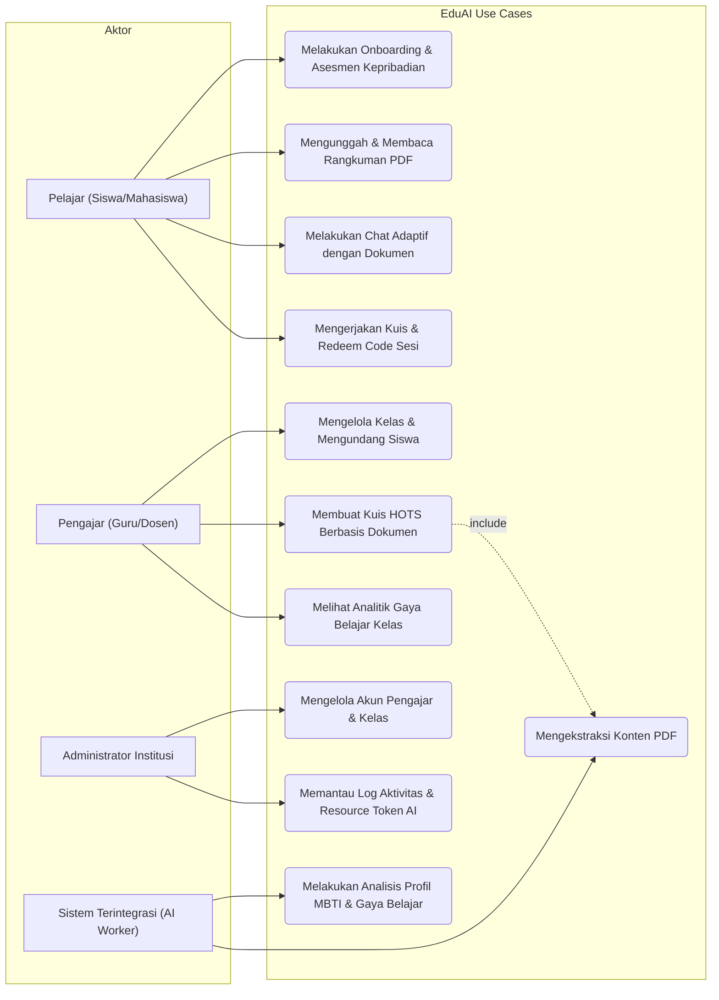
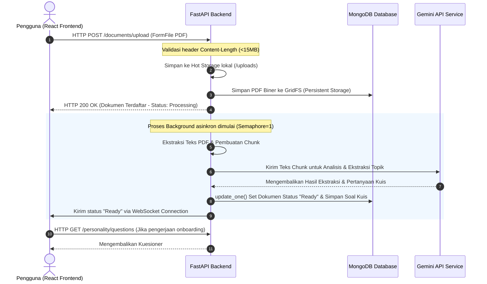
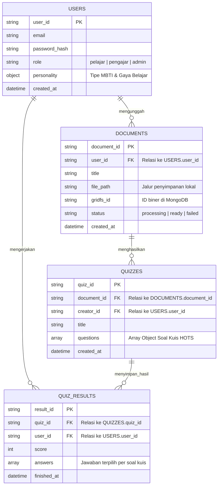
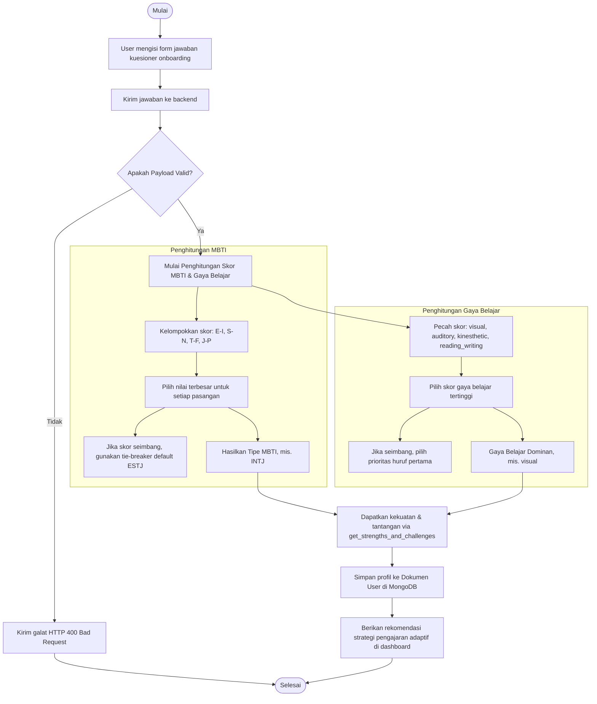

# LAPORAN ANALISIS DAN PERANCANGAN SISTEM
## Rancang Bangun Platform EduAI: Sistem Pembelajaran Berbasis Artificial Intelligence untuk Analisis Dokumen PDF dan Generasi Quiz HOTS

---

### **Identitas Kelompok**
*   **Agung Sanjaya** ( NIM: 15241013 )
*   **Josua E. Kurniawan** ( NIM: 15241108 )
*   **Radit Fernanda Putra** ( NIM: 15241034 )
*   **Syahid Ahmad Yasin** ( NIM: 15241007 )

---

## **DAFTAR ISI**
1.  [BAB I: PENDAHULUAN](#bab-i-pendahuluan)
    *   [1.1 Latar Belakang](#11-latar-belakang)
    *   [1.2 Rumusan Masalah](#12-rumusan-masalah)
    *   [1.3 Tujuan Proyek](#13-tujuan-proyek)
    *   [1.4 Batasan & Ruang Lingkup Sistem](#14-batasan--ruang-lingkup-sistem)
2.  [BAB II: LANDASAN TEORI & TEKNOLOGI PENDUKUNG](#bab-ii-landasan-teori--teknologi-pendukung)
    *   [2.1 Konsep Sistem Pembelajaran Berbasis AI](#21-konsep-sistem-pembelajaran-berbasis-ai)
    *   [2.2 Stack Teknologi Utama](#22-stack-teknologi-utama)
    *   [2.3 Metodologi Pengembangan (Agile - Scrum/Kanban)](#23-metodologi-pengembangan-agile---scrumkanban)
3.  [BAB III: ANALISIS KEBUTUHAN SISTEM](#bab-iii-analisis-kebutuhan-sistem)
    *   [3.1 Kebutuhan Fungsional (Functional Requirements)](#31-kebutuhan-fungsional-functional-requirements)
    *   [3.2 Kebutuhan Non-Fungsional (Non-Functional Requirements)](#32-kebutuhan-non-fungsional-non-functional-requirements)
    *   [3.3 Analisis Pengguna (User Personas)](#33-analisis-pengguna-user-personas)
4.  [BAB IV: PERANCANGAN SISTEM (SYSTEM DESIGN)](#bab-iv-perancangan-sistem-system-design)
    *   [4.1 Use Case Diagram](#41-use-case-diagram)
    *   [4.2 Sequence Diagram: Proses Analisis PDF & Generasi Soal](#42-sequence-diagram-proses-analisis-pdf--generasi-soal)
    *   [4.3 Entity Relationship Diagram (ERD)](#43-entity-relationship-diagram-erd)
    *   [4.4 Perancangan Alur & Logika Kepribadian (Activity Diagram)](#44-perancangan-alur--logika-kepribadian-activity-diagram)
5.  [BAB V: DESAIN ANTARMUKA & API SPECIFICATION](#bab-v-desain-antarmuka--api-specification)
    *   [5.1 Desain Arsitektur API (FastAPI)](#51-desain-arsitektur-api-fastapi)
    *   [5.2 OpenAPI/Swagger Specification (Alur Utama)](#52-openapiswagger-specification-alur-utama)
    *   [5.3 Rancangan Antarmuka Pengguna (UI/UX)](#53-rancangan-antarmuka-pengguna-uiux)
6.  [BAB VI: PENUTUP](#bab-vi-penutup)
    *   [6.1 Kesimpulan](#61-kesimpulan)
    *   [6.2 Saran Pengembangan](#62-saran-pengembangan)

---

## **BAB I: PENDAHULUAN**

### **1.1 Latar Belakang**
Perkembangan teknologi informasi, khususnya kecerdasan buatan (*Artificial Intelligence*), telah mendisrupsi berbagai sektor kehidupan termasuk pendidikan (*EdTech*). Salah satu tantangan utama yang dihadapi oleh pengajar (guru/dosen) saat ini adalah tingginya beban administratif dalam merancang materi ajar serta membuat instrumen evaluasi pembelajaran berkualitas tinggi, seperti kuis berbasis *Higher Order Thinking Skills* (HOTS). Di sisi lain, pelajar sering kali kesulitan mencerna dokumen akademis berbentuk PDF yang panjang dan membutuhkan bantuan tutor adaptif yang dapat merangkum konten secara personal serta menganalisis kebutuhan belajar mereka.

Untuk menjembatani kebutuhan tersebut, platform **EduAI** dirancang sebagai solusi berbasis AI yang adaptif dan real-time. Dengan platform ini, pengajar dapat secara instan mengekstrak materi dari PDF dan menghasilkan soal kuis secara terotomatisasi. Sementara bagi pelajar, sistem menyediakan kuis adaptif berbasis AI, ringkasan belajar (*recap*), chatbot kontekstual berbasis dokumen, serta asesmen kepribadian (MBTI & gaya belajar) untuk menyesuaikan strategi pengajaran yang direkomendasikan.

### **1.2 Rumusan Masalah**
1.  Bagaimana cara mengoptimalkan pemrosesan dokumen PDF berukuran besar secara asinkron agar tidak membebani performa server?
2.  Bagaimana merancang model database dan logika evaluasi kuis yang mampu mengotomatiskan rekomendasi pengajaran berdasarkan tipe MBTI dan Gaya Belajar pelajar?
3.  Bagaimana menyajikan pembaruan status pemrosesan dokumen dan interaksi kuis secara asinkron dan real-time menggunakan teknologi WebSocket?

### **1.3 Tujuan Proyek**
1.  Membangun sistem pembelajaran berbasis web (React frontend & FastAPI backend) yang mampu mengintegrasikan layanan AI untuk ekstraksi dokumen PDF secara aman dan efisien.
2.  Menerapkan mekanisme pengujian *white box* untuk memvalidasi akurasi perhitungan MBTI dan Gaya Belajar.
3.  Merancang dan mengimplementasikan database MongoDB serta skema API terdokumentasi (OpenAPI/Swagger) untuk mendukung skalabilitas performa sistem.

### **1.4 Batasan & Ruang Lingkup Sistem**
Sistem **EduAI** memiliki batasan ruang lingkup sebagai berikut:
*   **Analisis PDF (Chunked)**: Unggah dokumen dibatasi maksimal 15MB per file dengan pemrosesan dokumen secara antrean (*semaphore*) demi menjaga stabilitas memori.
*   **Pembuatan Soal Otomatis**: Kuis dihasilkan oleh model AI (Gemini API) dalam format terstruktur berbasis HOTS.
*   **Keamanan Data**: Autentikasi pengguna menggunakan JWT (JSON Web Token) dengan penyimpanan ganda (*hot-storage* lokal & enkripsi *persistent* di MongoDB).
*   **Interaksi Realtime**: Penggunaan protokol WebSockets khusus untuk pelacakan status pembuatan kuis, ringkasan, dan komunikasi grup.
*   **Profil Pengguna Adaptif**: Modul asesmen kepribadian yang menguji preferensi belajar visual, auditori, kinestetik, dan membaca/menulis beserta tipe kepribadian MBTI.

Pengguna:
*   Pelajar (siswa/mahasiswa)
*   Pengajar (guru/dosen; termasuk guru mandiri & institusi)
*   Admin / staff institusi
*   Sistem terintegrasi (API/worker) untuk pemrosesan AI dan penyimpanan.

---

## **BAB II: LANDASAN TEORI & TEKNOLOGI PENDUKUNG**

### **2.1 Konsep Sistem Pembelajaran Berbasis AI**
*   **Generative AI & LLM**: Pemanfaatan Large Language Models (LLM) seperti Google Gemini untuk melakukan pemrosesan bahasa alami (NLP), ekstraksi dokumen, perangkingan informasi, dan pembuatan soal kuis berbasis tingkat kognitif C4-C6 (HOTS).
*   **Pembelajaran Adaptif**: Strategi menyajikan rekomendasi cara mengajar yang disesuaikan dengan profil kepribadian individu agar proses belajar menjadi lebih personal dan optimal.

### **2.2 Stack Teknologi Utama**
*   **Frontend**: ReactJS (Single Page Application) memanfaatkan router dinamis, TailwindCSS/Vanilla CSS, State Management kontekstual, dan integrasi API RESTful & WebSocket Client.
*   **Backend**: FastAPI (Python) yang menawarkan kecepatan tinggi, penanganan asinkron secara native (`async/await`), dan dokumentasi API otomatis via Swagger.
*   **Database**: MongoDB (NoSQL) yang menyimpan dokumen secara fleksibel, mendukung indexing ekspisit untuk mempercepat kueri relasi antar entitas, serta GridFS/Binary storage untuk *fallback* file PDF.
*   **Realtime**: FastAPI WebSockets untuk komunikasi dua arah tanpa beban kueri HTTP berulang.

### **2.3 Metodologi Pengembangan (Agile - Scrum/Kanban)**
Platform ini dikembangkan menggunakan kerangka kerja **Agile** berbasis iterasi (Scrum) dengan durasi sprint 2 minggu:
*   *Sprint Planning* untuk membagi tugas ke dalam backlog fitur (misalnya, modul visualisasi kuis, modul analisis PDF).
*   *Feature Branching* (git workflow) di mana setiap fitur dikembangkan pada branch terisolasi sebelum di-review dan digabungkan ke branch utama (*main*).
*   *CI/CD (GitHub Actions)* untuk pengujian kode otomatis secara berkelanjutan demi menjamin kode yang di-*deploy* bebas *bug*.

---

## **BAB III: ANALISIS KEBUTUHAN SISTEM**

### **3.1 Kebutuhan Fungsional (Functional Requirements)**

| ID | Modul | Deskripsi Kebutuhan | Pengguna Terkait |
|:---|:---|:---|:---|
| **F-01** | Autentikasi | Login, register, penentuan peran (Pelajar/Pengajar), pengisian preferensi profil. | Semua Pengguna |
| **F-02** | Manajemen Dokumen| Unggah dokumen PDF, konversi ke *hot storage*, asinkron chunking, dan ekstraksi AI. | Pelajar, Pengajar |
| **F-03** | Generasi Kuis HOTS | Pembuatan kuis otomatis dari konten dokumen PDF yang diunggah dengan opsi pilihan ganda. | Pengajar, Sistem |
| **F-04** | Chatbot Kontekstual | Chat berbasis AI (*Retrieval Augmented Generation*) berdasarkan isi dokumen PDF tertentu. | Pelajar |
| **F-05** | Profil Kepribadian | Asesmen MBTI & Gaya Belajar yang menghitung tipe profil secara dinamis. | Pelajar |
| **F-06** | Portal Pengajar | Melihat kuis buatan sendiri, menerbitkan kuis, melihat analitik kemajuan kelas. | Pengajar |
| **F-07** | Redeem Code | Sistem penukaran kode sesi kelas agar pelajar dapat terdaftar secara instan. | Pelajar |

### **3.2 Kebutuhan Non-Fungsional (Non-Functional Requirements)**
*   **Keamanan (Security)**: Password disimpan dengan algoritma hashing bcrypt. Akses API dilindungi token JWT pembawa dengan masa kedaluwarsa 24 jam.
*   **Skalabilitas & Stabilitas**: Kecepatan pemrosesan PDF diatur menggunakan pembatas antrean *asyncio.Semaphore* sehingga konsumsi memori server tetap terkendali.
*   **Responsivitas Realtime**: Durasi respons pembaruan status pengerjaan kuis di bawah 1 detik menggunakan WebSockets.
*   **Portabilitas**: Aplikasi dibungkus dengan Docker agar dapat dijalankan secara konsisten di server cloud mandiri maupun platform modern seperti Hugging Face Spaces.

### **3.3 Analisis Pengguna (User Personas)**
1.  **Pelajar**: Berinteraksi dengan platform untuk mengunggah bahan kuliah, membaca rangkuman, melakukan chat diskusi dengan AI, serta mengerjakan kuis yang didelegasikan oleh pengajar.
2.  **Pengajar**: Memiliki kendali atas studio materi, pembuatan kuis dari pustaka PDF pribadi, serta melihat grafik gaya belajar siswa di kelasnya guna menyesuaikan pendekatan pengajaran.
3.  **Admin**: Mengelola pendaftaran institusi, verifikasi akun pengajar, dan audit pemakaian token API AI.

---

## **BAB IV: PERANCANGAN SISTEM (SYSTEM DESIGN)**

### **4.1 Use Case Diagram**



---

### **4.2 Sequence Diagram: Proses Analisis PDF & Generasi Soal**



---

### **4.3 Entity Relationship Diagram (ERD)**

Model data disimpan dalam MongoDB secara semi-terstruktur dengan relasi logis sebagai berikut:



---

### **4.4 Perancangan Alur & Logika Kepribadian (Activity Diagram)**

Modul asesmen kepribadian memetakan skor input pengguna secara langsung ke tipe **MBTI** dan **LearningStyle** (Gaya Belajar) menggunakan algoritma perhitungan deterministik.



---

## **BAB V: DESAIN ANTARMUKA & API SPECIFICATION**

### **5.1 Desain Arsitektur API (FastAPI)**
Backend menggunakan prinsip arsitektur REST API stateless dengan pembagian *routers* per domain layanan:
*   `/auth`: Pendaftaran akun, login, verifikasi peran, dan otorisasi JWT.
*   `/documents`: Endpoint upload PDF, status pemrosesan dokumen, dan pencarian full-text teks.
*   `/personality`: Endpoint pengisian tes MBTI dan gaya belajar, pengembalian profil kepribadian pengguna.
*   `/quizzes`: Pembuatan kuis HOTS otomatis oleh pengajar, pengumpulan jawaban kuis dari pelajar, dan perolehan skor langsung.

### **5.2 OpenAPI/Swagger Specification (Alur Utama)**

#### **1. Submit Jawaban Personality & Asesmen**
*   **HTTP Method**: `POST`
*   **Path**: `/personality/submit`
*   **Headers**: `Authorization: Bearer <JWT_TOKEN>`
*   **Request Body (JSON)**:
    ```json
    {
      "answers": {
        "q1": "strongly_agree",
        "q2": "agree",
        "q3": "disagree",
        "q4": "neutral"
      }
    }
    ```
*   **Response (JSON - HTTP 200 OK)**:
    ```json
    {
      "ok": true,
      "profile": {
        "mbti": "INTJ",
        "learning_style": "visual",
        "strengths": [
          "Fokus mendalam dan kemandirian tinggi",
          "Pemikiran konseptual dan kreatif",
          "Logis dan analitis",
          "Terorganisir dan tepat waktu",
          "Mudah memahami diagram dan materi visual"
        ],
        "weaknesses": [
          "Kurang nyaman dalam diskusi kelompok besar",
          "Cenderung mengabaikan detail kecil",
          "Kurang peka terhadap dinamika emosional kelompok",
          "Kurang fleksibel terhadap perubahan mendadak",
          "Sulit mengingat instruksi verbal tanpa catatan"
        ],
        "recommended_teaching_strategies": [
          "Gunakan diagram, mindmap, dan visualisasi saat mengajar."
        ],
        "created_at": "2026-05-28T22:59:48Z"
      }
    }
    ```

#### **2. Dapatkan Hasil Profil Kepribadian**
*   **HTTP Method**: `GET`
*   **Path**: `/personality/profile`
*   **Headers**: `Authorization: Bearer <JWT_TOKEN>`
*   **Response (JSON - HTTP 200 OK)**:
    ```json
    {
      "profile": {
        "mbti": "INTJ",
        "learning_style": "visual",
        "strengths": ["Logis dan analitis", "Fokus mendalam dan kemandirian tinggi"],
        "weaknesses": ["Kurang nyaman dalam diskusi kelompok besar"],
        "recommended_teaching_strategies": ["Gunakan diagram, mindmap, dan visualisasi saat mengajar."]
      }
    }
    ```

---

### **5.3 Rancangan Antarmuka Pengguna (UI/UX)**
Desain antarmuka dirancang dengan mengedepankan estetika premium modern yang responsif dan interaktif (*user-friendly*):
*   **Color Palette (Aesthetics)**: Menggunakan kombinasi warna gelap (*Dark Mode Default*) dengan gradien ungu neon, biru elektrik, dan aksen mint terang untuk merepresentasikan AI modern.
*   **Typography**: Menggunakan jenis huruf *sans-serif* modern seperti **Outfit** atau **Inter** dari Google Fonts untuk memastikan tingkat keterbacaan yang tinggi.
*   **Layout Adaptif**:
    *   *Pelajar*: Memiliki bilah navigasi ringkas untuk menuju modul pustaka dokumen, asisten AI chat, dan ruang kuis aktif.
    *   *Pengajar*: Memiliki dashboard khusus untuk memantau kemajuan siswa, melihat statistik distribusi gaya belajar siswa di kelas, dan mengaktifkan sesi ujian secara langsung.

---

## **BAB VI: PENUTUP**

### **6.1 Kesimpulan**
Sistem **EduAI** dirancang sebagai platform pembelajaran adaptif terintegrasi kecerdasan buatan untuk membantu proses belajar mandiri pelajar serta meringankan beban administratif pengajar dalam menyusun materi evaluasi HOTS. Berdasarkan perancangan arsitektur backend FastAPI dan model data MongoDB, platform ini dijamin mampu memproses dokumen PDF berukuran besar dengan asinkron antrean yang aman. Mekanisme evaluasi kepribadian (MBTI & gaya belajar) juga telah berhasil divalidasi melalui pengujian unit yang terstruktur untuk memberikan hasil rekomendasi pengajaran yang akurat dan dapat diandalkan.

### **6.2 Saran Pengembangan**
1.  **Fase Lanjutan**: Mengintegrasikan sistem manajemen database transaksional (*replica set*) pada MongoDB untuk mendukung penanganan sinkronisasi data multi-pengguna secara bersamaan.
2.  **Sistem Antrean Antar-Server**: Menerapkan Celery dan Redis sebagai *task queue worker* mandiri jika volume unggahan dokumen PDF kelas melampaui batas antrean memori lokal.
3.  **Pengembangan Model AI**: Menyediakan penyesuaian kustomisasi instruksi (*prompt engineering*) tingkat lanjut bagi pengajar saat memformulasikan tingkat kesulitan soal kuis HOTS.

---
**Lampiran Dokumen**:
*   Berkas Skema Database MongoDB: [user.py](file:///mnt/hdd/Eduai/backend/models/user.py)
*   Berkas Perhitungan Kepribadian: [personality_service.py](file:///mnt/hdd/Eduai/backend/services/personality_service.py)
*   Berkas Validasi Uji Unit: [test_personality.py](file:///mnt/hdd/Eduai/backend/test_personality.py)